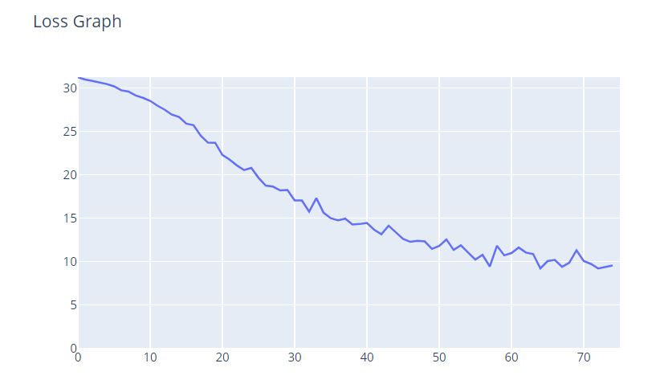

# MiniTorch Module 4


* Docs: https://minitorch.github.io/

To run this, you will need to install and download the MNist library.

(On Mac, this may require installing the `wget` command)

```
pip install python-mnist
mnist_get_data.sh
```


* Tests: (Currently not working)

```
python run_tests.py
```

To run the models, open the GUI with the following command while being in the project folder

streamlit run app.py -- 4


<b>Results from training the Sentiment model on the terminal (Full output can be found on project/SentimentTrainingFinal.txt): </b>

Best Training Accuracy: 88.89%<br>
Best Validation Accuracy: 73%<br>
Mean Validation Accuracy: ~66%<br>
Average time per epoch: 26.6 seconds<br>
Number of Epochs: 87<br>
Best Loss: 8.7<br>

<b>Results from training the Sentiment model on Streamlit using the default parameters:</b>

Best Training Accuracy: 0.889<br>
Best Validation Accuracy: 0.74<br>
Average time per epoch: 36.5 seconds<br>
Number of Epochs: 75<br>
Best Loss: 9.132<br>

<b>Accuracy plot:</b>
 <br>
<b>Loss plot:</b>
 <br>
<b>Epochs table:</b>
 <br>

<b>Results from training the Multiclass image classification model on the terminal (Full output can be found on project/TrainMnistFinal.txt)</b>

Best result: 16 correct<br>
Convergence result: 15 correct<br>
Number of Epochs: 2<br>
Best Loss: 0.77<br>

<b>Results from training the Multiclass image classification model on streamlit with 100 epochs and learning rate of 0.05:</b>

Best result: 15 correct<br>
Convergence result: 14 correct<br>
Number of Epochs: 100<br>
Average time per epoch: 48.4 seconds<br>
Best Loss: 1.259<br>
<b>Layers plot:<br>
 <br>
Loss plot:<br>
 <br>
Epochs table:<br>
 <br></b>
